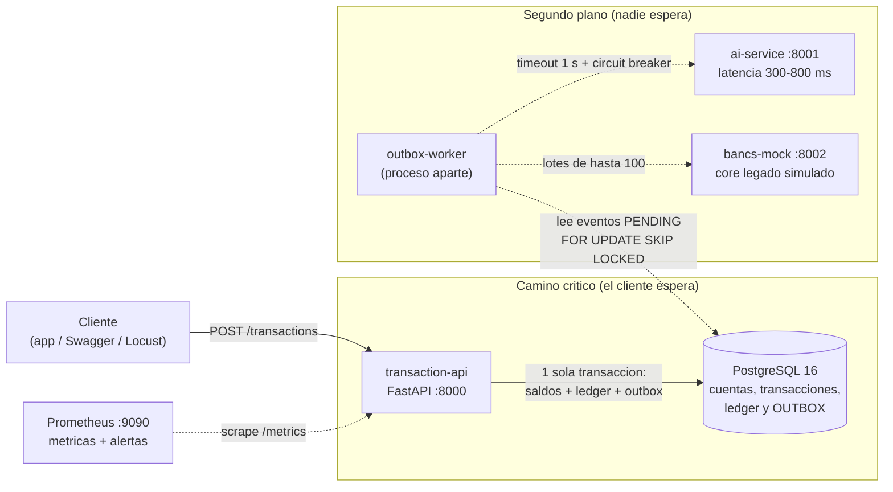

# SmartBancs App

Plataforma de transferencias en tiempo real para una institución financiera, con recomendaciones por IA.
Está diseñada alrededor de tres restricciones del reto: **alta concurrencia** (picos de hasta 10.000 TPS), un **core legado (Bancs)** que
no aguanta consultas en caliente, y **latencia < 2 s** sin que la IA estorbe nunca al flujo de dinero.
Todo se levanta con un solo comando: `docker compose up`.

🎬 **Video de demostración:** https://youtu.be/iHruNPq2o7w

> **Idea central en una frase:** las dos cuentas de cada transferencia se bloquean **siempre en orden ascendente de `account_id`**
> (evita deadlocks), y todo lo lento o poco fiable (IA, Bancs) se hace **después**, en segundo plano, a través de un *outbox*.

---

## 1. ¿Dónde está cada sección del reto?

| Sección del reto | Qué se pide | Dónde verlo en el repo |
|---|---|---|
| **3.1** Infraestructura, BD y backend | Stack, esquema, concurrencia, un solo comando | `docker-compose.yml` · `database/ddl/01_schema.sql`, `02_indexes.sql` · `database/dml/03_seed.sql` · `services/transaction-api/` (en especial `app/services/transfer_service.py` y `app/repositories/account_repository.py`) · ADR `0002`, `0003`, `0004`, `0005` · pruebas `tests/concurrency/` · [DOCUMENTO_TECNICO §4](docs/DOCUMENTO_TECNICO.md#4-31-infraestructura-base-de-datos-y-backend) |
| **3.2** Integración con Bancs | Sincronizar sin saturar al legado; ETL | `services/bancs-mock/` · `services/transaction-api/app/workers/outbox_worker.py` · `app/services/bancs_client.py` · `app/services/reconciliation_service.py` · `etl/transform.py`, `etl/generate_raw_data.py` · `database/ddl/04_analytics.sql` · ADR `0008` · [DOCUMENTO_TECNICO §5](docs/DOCUMENTO_TECNICO.md#5-32-integración-con-bancs-y-etl) |
| **3.3** IA | Integración sin bloquear + ciclo de vida del modelo | `services/ai-service/` · `services/transaction-api/app/services/ai_client.py`, `circuit_breaker.py` · ADR `0006`, `0007` · `scripts/ai_resilience_demo.sh` · `evidence/ai-resilience/` · [DOCUMENTO_TECNICO §6](docs/DOCUMENTO_TECNICO.md#6-33-inteligencia-artificial) |
| **3.4** Observabilidad | Logs, métricas, trazas, alertas | `services/transaction-api/app/observability/` (logging, métricas, trazas, middleware) · `observability/prometheus/prometheus.yml`, `alerts.yml`, `alerts_test.yml` · ADR `0001`, `0009` · [DOCUMENTO_TECNICO §7](docs/DOCUMENTO_TECNICO.md#7-34-observabilidad) |
| **3.5** Incidente simulado | Reproducir, detectar, diagnosticar, estabilizar | `tests/incident/reproduce_deadlock.py`, `exhaust_pool.py` · `services/transaction-api/app/api/diagnostics_routes.py` y `app/services/diagnostics_service.py`, `blocking_tree.py` · `database/ddl/05_diagnostics.sql` · `tests/load/locustfile.py`, `scripts/load_test.sh` · `evidence/incident/`, `evidence/load-test-results/` · [DOCUMENTO_TECNICO §8](docs/DOCUMENTO_TECNICO.md#8-35-incidente-simulado) |
| **3.6** Post mortem y prevención | Análisis del incidente y acciones | [`docs/POSTMORTEM.md`](docs/POSTMORTEM.md) · [DOCUMENTO_TECNICO §9](docs/DOCUMENTO_TECNICO.md#9-36-post-mortem-y-acciones-preventivas) |
| Entregables generales | Declaración de uso de IA, decisiones, diagramas | [`DECLARACION_USO_IA.md`](DECLARACION_USO_IA.md) · `docs/adr/` (9 decisiones) · [`docs/diagrams/DIAGRAMAS.md`](docs/diagrams/DIAGRAMAS.md) · [escalabilidad a 10.000 TPS](docs/DOCUMENTO_TECNICO.md#10-escalabilidad-a-10000-tps) · [limitaciones](docs/DOCUMENTO_TECNICO.md#11-limitaciones-conocidas) |

---

## 2. Arquitectura



Más diagramas (secuencia de una transferencia, sincronización con Bancs, ETL y deadlock): [`docs/diagrams/DIAGRAMAS.md`](docs/diagrams/DIAGRAMAS.md).

---

## 3. Prerrequisitos

| Herramienta | Versión | Para qué |
|---|---|---|
| **Docker Desktop** (o Docker Engine) con **Compose v2** | Probado con Docker **29.8.0** | Es lo único indispensable: todo (API, BD, IA, Bancs, pruebas, ETL) corre en contenedores |
| Memoria libre para Docker | ≥ 4 GB (las mediciones se hicieron con 3,8 GB) | La prueba de carga corre en la misma máquina |
| `make` *(opcional)* | GNU Make 4.x | Atajos. **Sin `make` funciona igual**: cada comando tiene su equivalente con `docker compose` (sección 4) |
| `bash` *(opcional)* | Git Bash o WSL en Windows | Solo para `make load`, `make ai-resilience` y `make bancs-resilience`, que son scripts `.sh` |
| `curl` *(opcional)* | cualquiera | Probar los endpoints desde la terminal |

No necesitas instalar Python, PostgreSQL ni dependencias en tu máquina.

---

## 4. Instalar, ejecutar, probar y DETENER

Cada acción tiene dos formas: con `make` y su equivalente con `docker compose` (útil en **Windows** si no tienes `make`;
funciona igual en PowerShell y CMD).

### 4.1 Instalar
```bash
git clone https://github.com/cmorillo-oss/smartbancs-app-tcs.git smartbancs-app
cd smartbancs-app
cp .env.example .env        # opcional: el compose ya trae valores por defecto
```
En PowerShell: `Copy-Item .env.example .env`. No hace falta instalar nada más: la primera ejecución construye las imágenes.

### 4.2 Ejecutar (levantar todo)

| Con `make` | Equivalente con `docker compose` |
|---|---|
| `make up` | `docker compose up -d --build` |
| `make logs` | `docker compose logs -f --tail=100` |

Comprobar que está vivo:
```bash
curl localhost:8000/health   # {"status":"ok"}
curl localhost:8000/ready    # {"status":"ready","database":"connected"}
```
En PowerShell usa `curl.exe` (a secas, `curl` es un alias de otra cosa) o abre `http://localhost:8000/docs` en el navegador.

Servicios y puertos: API `8000` · IA `8001` · Bancs mock `8002` · Prometheus `9090` · PostgreSQL `5432`.

### 4.3 Probar

| Qué | Con `make` | Equivalente con `docker compose` |
|---|---|---|
| Todas las pruebas | `make test` | ejecutar las tres siguientes, una por una |
| Pruebas unitarias (circuit breaker, árbol de bloqueos) | `make test-unit` | `docker compose --profile test run --rm -T tests pytest unit -v` |
| **Concurrencia** (sobregiro, suma cero, idempotencia, ledger) | `make test-concurrency` | `docker compose up -d --build postgres transaction-api` y luego `docker compose --profile test run --rm -T tests pytest concurrency -v` |
| Integración (transferencia → Bancs) | `make test-integration` | `docker compose up -d --build` y luego `docker compose --profile test run --rm -T tests pytest integration -v` |
| Reglas de alerta de Prometheus | `make alerts-test` | `docker compose up -d prometheus` y luego `docker compose exec -T prometheus promtool test rules /etc/prometheus/alerts_test.yml` |

### 4.4 Demos (lo que se muestra en el video)

| Demo | Con `make` | Equivalente con `docker compose` |
|---|---|---|
| **Dinero fantasma:** inseguro vs. seguro | `make demo-race` | `docker compose up -d --build postgres transaction-api` y luego `docker compose --profile test run --rm -T tests python concurrency/demo_race_condition.py` |
| **Deadlocks:** orden invertido vs. orden fijo | `make deadlock-demo` | `docker compose up -d --build` y luego `docker compose --profile test run --rm -T tests python incident/reproduce_deadlock.py` |
| **Pool agotado** (incidente 3.5) | `make exhaust-pool` | `docker compose up -d --build` y luego `docker compose --profile test run --rm -T tests python incident/exhaust_pool.py` |
| **Prueba de carga** (rampa hasta saturar, ~3,5 min) | `make load` | `bash scripts/load_test.sh` (necesita Git Bash o WSL) |
| **La IA se cae** | `make ai-down` (y `make ai-up`) | `docker compose stop ai-service` (y `docker compose start ai-service`) |
| Medición con IA encendida / apagada / colgada | `make ai-resilience` | `bash scripts/ai_resilience_demo.sh` |
| **Bancs se cae y vuelve** | `make bancs-resilience` | `bash scripts/bancs_resilience_demo.sh` |
| Bancs bajo carga (lotes vs. peticiones sueltas) | `make bancs-degradation` | `docker compose up -d bancs-mock` y luego `docker compose --profile test run --rm -T tests python integration/bancs_degradation.py` |
| **ETL** (CSV sucio → Parquet + tablas) | `make etl` | `docker compose up -d postgres` y luego `docker compose --profile etl run --rm --build etl` |
| Últimos lotes enviados a Bancs | `make bancs-sync-log` | `docker compose exec -T postgres psql -U smartbancs -d smartbancs -c "SELECT batch_id, events_count, status, latency_ms, created_at FROM bancs_sync_log ORDER BY id DESC LIMIT 10"` |
| Diagnóstico del operador | `make diagnostics` | abrir en el navegador o con `curl.exe`: `http://localhost:8000/api/v1/admin/diagnostics/pool` (también `/locks`, `/blocking-tree`, `/slow-queries`) |
| Reponer datos de prueba | `make seed` | ver el `Makefile` (vacía las tablas y reaplica `03_seed.sql`) |

### 4.5 DETENER

| Qué quieres | Con `make` | Equivalente con `docker compose` |
|---|---|---|
| Detener todo **conservando los datos** | `make down` | `docker compose down` |
| Detener todo **y borrar los datos** (volver a empezar limpio) | `make clean` | `docker compose down -v --remove-orphans` |
| Detener solo la IA (demo) | `make ai-down` | `docker compose stop ai-service` |

> Esquema y datos de prueba (`database/`) se cargan **solo la primera vez** (volumen vacío). Si cambias los `.sql`, usa `make clean` y vuelve a levantar.

---

## 5. Endpoints

Documentación interactiva (Swagger UI): **http://localhost:8000/docs** · esquema OpenAPI: `http://localhost:8000/openapi.json`.

### transaction-api (`:8000`)

| Método y ruta | Para qué |
|---|---|
| `POST /api/v1/transactions` | Crear una transferencia. **Header obligatorio** `Idempotency-Key`. `201` creada · `200` + `Idempotent-Replay: true` si se repite la clave · `422 INSUFFICIENT_FUNDS` · `503 LOCK_TIMEOUT / DEADLOCK_RETRY_EXHAUSTED / POOL_TIMEOUT` |
| `GET /api/v1/transactions/{id}` | Detalle de una transferencia |
| `GET /api/v1/accounts/{account_number}` | Saldo y datos de la cuenta |
| `GET /api/v1/accounts/{account_number}/transactions` | Historial paginado |
| `GET /api/v1/customers/{customer_id}/recommendations` | Última recomendación de la IA (lee de la BD local; si no hay, devuelve una genérica) |
| `GET /api/v1/admin/reconciliation` | Compara saldos locales contra Bancs (máx. 50 cuentas) |
| `GET /api/v1/admin/diagnostics/pool` | Estado del pool de conexiones |
| `GET /api/v1/admin/diagnostics/locks` | Bloqueos activos (quién bloquea a quién) |
| `GET /api/v1/admin/diagnostics/blocking-tree` | Árbol de sesiones bloqueantes y el culpable |
| `GET /api/v1/admin/diagnostics/slow-queries` | Consultas más costosas (`pg_stat_statements`) |
| `GET /health` | Liveness (no toca la BD) |
| `GET /ready` | Readiness: comprueba la BD y responde `503 pool_exhausted` si el pool está agotado |
| `GET /metrics` | Métricas Prometheus |
| `GET /docs` | Swagger UI |

### Servicios auxiliares

| Servicio | Ruta | Para qué |
|---|---|---|
| ai-service `:8001` | `POST /api/v1/recommendations` · `GET /health` · `GET /metrics` | Recomendaciones por reglas (latencia simulada 300-800 ms; fallos inyectables con `AI_FAILURE_RATE`) |
| bancs-mock `:8002` | `POST /bancs/v1/accounts/balance/batch` · `GET /bancs/v1/accounts/{n}` · `GET /health` · `GET /metrics` | Core legado simulado (200-500 ms; se degrada por encima de 10 peticiones simultáneas) |
| Prometheus `:9090` | UI web, `/alerts` | Métricas y estado de las alertas |

Los endpoints `admin` **no tienen autenticación** (ver limitaciones).

Ejemplo de transferencia:
```bash
curl -X POST localhost:8000/api/v1/transactions \
  -H "Content-Type: application/json" -H "Idempotency-Key: $(python -c 'import uuid;print(uuid.uuid4())')" \
  -d '{"source_account":"ACC-000001","dest_account":"ACC-000002","amount":"25.00","currency":"USD"}'
```
(Los nombres de cuentas de ejemplo salen de `database/dml/03_seed.sql`; también sirve `ACC-TEST-CONCURRENCY`, con saldo 1000.00.)

---

## 6. Resultados reales medidos

Todas las cifras salen de los archivos guardados en `evidence/` (se indica cuál). Se midieron en **una sola máquina Windows con Docker Desktop
(3,8 GB para Docker)**, con la API en **un solo proceso**, y el generador de carga corriendo en la misma máquina. Son cifras de un portátil, no de producción:
sirven para demostrar comportamiento y localizar cuellos de botella, no para prometer capacidad.

### 6.1 Concurrencia: no se pierde ni se crea dinero
Fuente: `evidence/test-data/test_concurrency_output.txt` → **4 pruebas, 4 aprobadas (14,67 s)**.

| Prueba | Qué exige | Resultado |
|---|---|---|
| Sobregiro concurrente | 100 transferencias simultáneas de 50.00 sobre una cuenta de 1000.00 → solo 20 triunfan, saldo final 0.00 | ✅ |
| Suma cero | 200 transferencias aleatorias entre 20 cuentas en paralelo → el dinero total no cambia | ✅ |
| Idempotencia | 50 peticiones simultáneas con la misma clave → exactamente 1 transacción | ✅ |
| Integridad del ledger | suma de DEBIT == suma de CREDIT | ✅ |

### 6.2 Dinero fantasma: implementación insegura vs. segura
Fuente: `evidence/test-data/demo_race_condition_output.txt`.

| Escenario | Inseguro (sin `FOR UPDATE`) | Seguro (la API real) |
|---|---|---|
| A: 100 × 50.00 sobre una cuenta de 1000.00 (deben triunfar 20) | **100 "exitosas"** = 5.000 prometidos con solo 1.000 disponibles; saldos finales 950 / 50 (incoherentes) | 20 exitosas, saldo 0.00 / 1000.00 |
| B: 200 transferencias aleatorias entre 20 cuentas | Dinero total pasó de 200.000,00 a **204.551,00: 4.551,00 de dinero fantasma**; 75 deadlocks | 200.000,00 → 200.000,00; **0** deadlocks; 200 exitosas |

### 6.3 Deadlocks: 29 vs. 0
Fuente: `evidence/incident/deadlock_demo.txt` (30 transferencias cruzadas A→B y B→A a la vez; conteo tomado de `pg_stat_database` de PostgreSQL, no del script).

| | Orden invertido | Orden por `account_id` (API) |
|---|---|---|
| Completadas | 1 | **30** |
| Abortadas por deadlock (SQLSTATE 40P01) | **29** | **0** |
| Espera de la víctima hasta el error | 1,11 s de media (`deadlock_timeout` = 1 s) | – |

### 6.4 Bancs: por lotes se le hace mucho menos daño
Fuente: `evidence/bancs/degradation.txt` y `resilience.txt`.

| Prueba | Resultado |
|---|---|
| Consultas directas con 1 → 10 simultáneas | p95 ≈ 0,5 s, 0 % de error |
| Consultas directas con 20 → 80 simultáneas | p95 1,5 → 6,9 s, **62-78 % de error 503**: Bancs *rinde menos* al saturarse |
| 1.000 cambios de saldo, uno por petición (10 simultáneas) | 1.000 peticiones, **37,7 s** |
| 1.000 cambios de saldo, en lotes de 100 | **10 peticiones, 4,1 s**, 1.000 entregados |
| Bancs apagado durante 40 transferencias | 40/40 OK, 40 eventos acumulados, circuito abierto, 0 en `DEAD`; al volver, el atraso llega a 0 en ~24 s y la conciliación da `MATCH` |

### 6.5 La IA no afecta a las transferencias
Fuente: `evidence/ai-resilience/comparison.txt` (3 rondas × 100 transferencias, 10 simultáneas, condiciones alternadas). Mediana de p95:

| IA encendida | IA apagada | IA colgada |
|---|---|---|
| 638 ms | 570 ms | 613 ms |

Con la IA apagada o colgada la latencia **no empeora** (incluso baja algo, porque la IA compite por CPU). Con una IA síncrona cada transferencia pagaría entre 300 y 800 ms extra.

### 6.6 Prueba de carga: ~37 TPS sostenidos (37-47 según la corrida)
Fuente: `evidence/load-test-results/load_report.txt` (rampa de 10 a 300 usuarios, 5.000 cuentas, mezcla 70 % transferencias / 20 % saldo / 10 % historial; SLO: p95 < 2 s y errores < 1 %).

| Usuarios | Transferencias/s | p95 | Errores | ¿Cumple SLO? |
|---|---|---|---|---|
| 10 | 34,9 | 469 ms | 0 % | sí |
| 25 | 33,6 | 1.206 ms | 0 % | sí |
| **50** | **36,8** | **1.853 ms** | **0 %** | **sí — máximo sostenido** |
| 75 | 38,6 | 3.045 ms | 0,1 % | no |
| 100 | 34,7 | 4.747 ms | 0,3 % | no |
| 150 | 33,5 | 6.797 ms | 8,0 % | no |
| 300 | 2,9 | 15.543 ms | 76 % | no |

**TPS máximo sostenido cumpliendo el SLO: ≈ 37 transferencias/s** (52 peticiones/s en total). Más allá, el sistema *se degrada* en lugar de escalar: la cola del pool crece y aparecen 503 (todos los errores son `503 POOL_TIMEOUT`, también en las lecturas). **Tres corridas dieron 47, 41,8 y 36,8** (la tabla es la última, la que está en `evidence/`): la variación entre corridas es de ~25 %, así que la cifra honesta es **"entre ~37 y ~47 TPS por proceso"**. Con 300 usuarios la última corrida colapsó (76 % de errores).
**Corrección del dinero bajo carga** (`verification.txt`): las 5.000 cuentas suman **5.000.000.000,00 antes y después** (conservado), el ledger **cuadra** (DEBIT = CREDIT = 596.330,00 en 6.092 transferencias) y hubo **0 deadlocks** en PostgreSQL.
CPU durante la carga (`docker_stats.csv`, 100 % = un núcleo): **transaction-api media 70 % (pico 111 %)**, postgres media 31 % (pico 79 %), outbox-worker media 38 %. El cuello de botella es la **CPU de la API**, no la base de datos → ver [escalabilidad a 10.000 TPS](docs/DOCUMENTO_TECNICO.md#10-escalabilidad-a-10000-tps).

### 6.7 Incidente simulado (pool agotado)
Fuente: `evidence/incident/exhaust_pool.txt`. Una sola sesión que retiene una fila paraliza a las 30 conexiones del pool: hasta 174 peticiones en cola, **100 % de las transferencias fallan con 503**.
`/ready` lo detectó en **1,0 s**, `/diagnostics/blocking-tree` identificó a la sesión culpable en **1,0 s**, y al liberar el bloqueo el sistema se recuperó de inmediato.

### 6.8 ETL
Fuente: `evidence/etl/etl_report.txt`. 4.415 filas leídas → 3.954 limpias + 461 en cuarentena (10,4 %, cada una con su motivo) → 3.954 cargadas; el control `leídos = limpios + cuarentena` cuadra. Parquet: 114.848 bytes frente a 420.635 del CSV. Duración total: 0,9 s.

---

## 7. Limitaciones conocidas y hoja de ruta

Lista completa y honesta en [`DOCUMENTO_TECNICO.md §11`](docs/DOCUMENTO_TECNICO.md#11-limitaciones-conocidas). Las más importantes:

- **No se demostró 10.000 TPS.** Se midieron ~37-47 TPS con un proceso; los 10.000 son una **proyección con aritmética**, no una medición.
- **Bancs e IA son simulados** (mocks); sus latencias y umbrales son supuestos razonables, no datos de un sistema real.
- **Los endpoints `admin` no tienen autenticación** ni hay TLS: fuera del alcance del reto, obligatorios antes de producción.
- **Una sola instancia de PostgreSQL**, sin réplica ni respaldo automatizado.
- **Trazas OpenTelemetry generadas pero no exportadas** por defecto (no hay colector en el compose) y no hay dashboards de Grafana.
- **El monitoreo de *data drift* de la IA está diseñado en el documento técnico, no implementado.**

Hoja de ruta: más procesos/réplicas de la API → PgBouncer → réplica de lectura → particionar por `account_id` (ver sección 10 del documento técnico).

---

## 8. Estructura del repositorio

```
├── docker-compose.yml, Makefile, .env.example
├── database/         esquema (ddl/), índices, seed (dml/), tablas analíticas y de diagnóstico
├── services/         transaction-api (+ outbox-worker, misma imagen) · ai-service · bancs-mock
├── etl/              pipeline de 4 etapas, generador del CSV sucio, cuarentena
├── observability/    prometheus.yml, alerts.yml y sus pruebas
├── tests/            unit/ · concurrency/ · integration/ · incident/ · load/
├── scripts/          load_test.sh, ai_resilience_demo.sh, bancs_resilience_demo.sh
├── evidence/         salidas reales de todas las pruebas y demos
└── docs/             DOCUMENTO_TECNICO.md, POSTMORTEM.md, adr/ (9 decisiones), diagrams/
```
