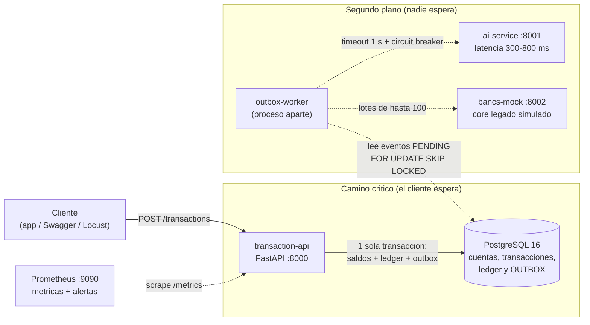
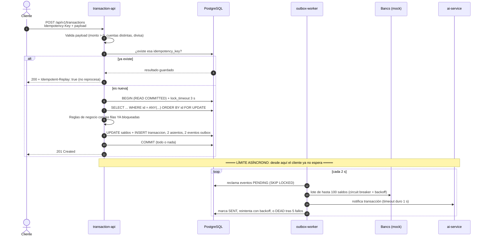
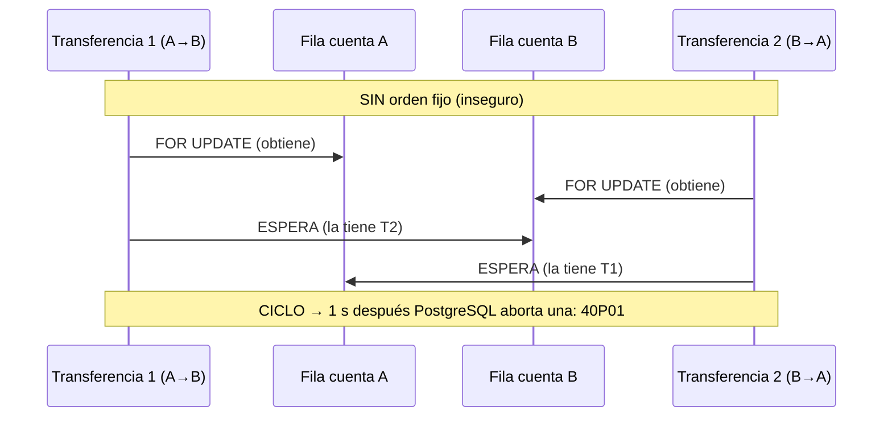
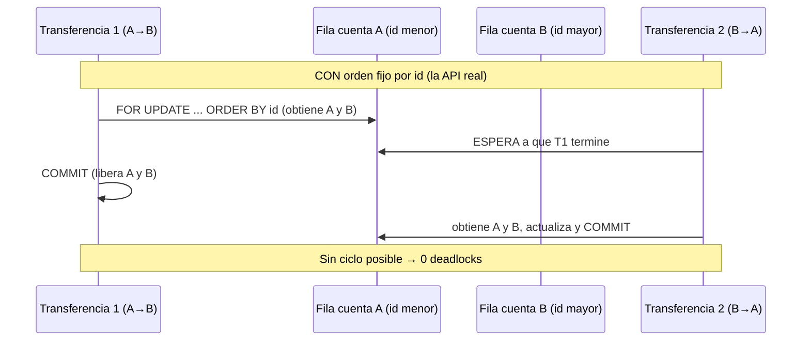
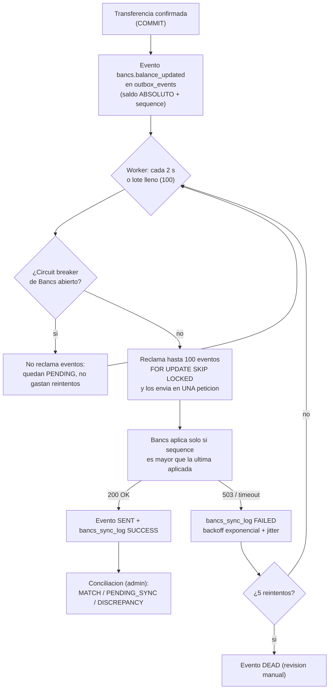
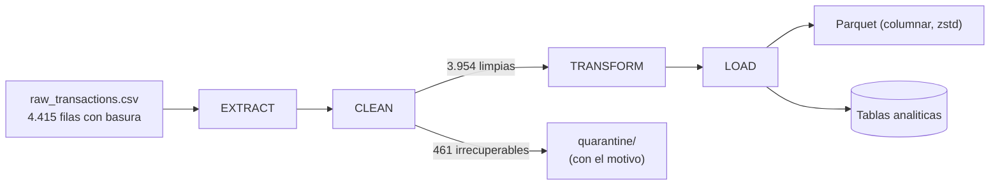

# SmartBancs App — Documento técnico

Documento de defensa técnica del reto. Está organizado igual que el enunciado (secciones 3.1 a 3.6) y termina con la escalabilidad a 10.000 TPS y una sección honesta de limitaciones.
Las cifras vienen de archivos reales en `evidence/`; cuando algo es una proyección o un supuesto, se dice.

**Índice:** [1 Resumen](#1-resumen-ejecutivo) · [2 Contexto](#2-contexto-y-restricciones) · [3 Arquitectura](#3-arquitectura-general) · [4 · 3.1](#4-31-infraestructura-base-de-datos-y-backend) · [5 · 3.2](#5-32-integración-con-bancs-y-etl) · [6 · 3.3](#6-33-inteligencia-artificial) · [7 · 3.4](#7-34-observabilidad) · [8 · 3.5](#8-35-incidente-simulado) · [9 · 3.6](#9-36-post-mortem-y-acciones-preventivas) · [10 Escalabilidad](#10-escalabilidad-a-10000-tps) · [11 Limitaciones](#11-limitaciones-conocidas)

---

## 1. Resumen ejecutivo

*(Es el guion de los 3 minutos de defensa.)*

**El problema.** Una institución financiera quiere transferencias en tiempo real con recomendaciones de IA, con picos de hasta 10.000 transacciones por segundo, un core legado (Bancs) que se cae si lo consultan en caliente, y respuesta en menos de 2 segundos.

**La solución en tres decisiones.**
1. **Bloqueo de cuentas siempre en orden ascendente de `account_id`** (`SELECT ... ORDER BY id FOR UPDATE`). Dos transferencias cruzadas (A→B y B→A) ya no se esperan en círculo: la segunda espera a la primera. Medido: con el orden invertido PostgreSQL abortó **29 de 30** transferencias por deadlock; con el orden fijo, **0 de 30**.
2. **Patrón Outbox.** Cada transferencia guarda, en la *misma* transacción de base de datos, el cambio de saldos, el asiento contable y dos eventos pendientes (uno para Bancs, otro para la IA). Un worker separado los entrega después. Así no hay transacciones distribuidas y nada externo puede frenar una transferencia.
3. **Bancs y la IA nunca están en el camino crítico.** Bancs recibe cambios de saldo **en lotes de 100** (1.000 cambios: 4,1 s en 10 peticiones frente a 37,7 s en 1.000). La IA responde en 300-800 ms, así que llamarla en línea sumaría eso a cada transferencia; con la IA apagada o colgada la latencia **no empeora** (p95 570-613 ms frente a 638 ms con IA encendida).

**Lo que se demostró.** 4/4 pruebas de concurrencia (100 transferencias simultáneas sobre 1.000,00: exactamente 20 triunfan, saldo 0,00); una implementación insegura de control produjo 4.551,00 de dinero fantasma en 200 transferencias, la segura 0,00. Prueba de carga real: **≈ 37 transferencias/s** (37-47 según la corrida) sostenidas con p95 < 2 s en **un solo proceso** de la API, con el dinero conservado, el ledger cuadrado y 0 deadlocks bajo carga. El incidente de quincena (pool de conexiones agotado) se reprodujo, se detectó en 1 s y se diagnosticó con endpoints propios.

**Lo que NO se demostró.** Los 10.000 TPS. Con un proceso el cuello de botella es la CPU de la API (70 % de media, picos de 97-134 %) y no PostgreSQL (~30 %). La ruta a 10.000 TPS es escalar la API horizontalmente, poner un pooler delante de PostgreSQL y luego particionar por `account_id`; es una **proyección con aritmética** (sección 10), no una medición.

---

## 2. Contexto y restricciones

| # | Restricción del reto | Consecuencia de diseño |
|---|---|---|
| 1 | **Alta concurrencia** (picos de 10.000 TPS) | Control de concurrencia correcto antes que rápido: bloqueo pesimista ordenado, idempotencia, pool de conexiones dimensionado y observable. |
| 2 | **Core legado Bancs** que se degrada con muchas consultas | Bancs *nunca* se consulta en el camino crítico. Las transferencias usan el saldo local; los cambios viajan a Bancs por outbox, en lotes, con circuit breaker. |
| 3 | **Latencia < 2 s** y la IA no puede retrasar el flujo | La IA se llama fuera del camino crítico (worker), con timeout duro de 1 s y circuit breaker. |

**Reglas de oro que gobiernan el código** (están comentadas en español, con el porqué, en el propio código):
1. Nunca llamar a un servicio externo (IA, Bancs) dentro de una transacción de base de datos.
2. Nunca esperar a la IA para responder al cliente.
3. Bloquear cuentas siempre en orden determinista (`account_id` ascendente).
4. Todo log es JSON estructurado y lleva `trace_id`.
5. Toda escritura de dinero es idempotente (`Idempotency-Key`).
6. Cada decisión relevante tiene su ADR en `docs/adr/`.
7. Todo se levanta con `docker compose up`.

---

## 3. Arquitectura general

### 3.1 Componentes

### 3.2 Secuencia de una transferencia

Los otros diagramas (sincronización con Bancs, ETL, deadlock) están en las secciones correspondientes y todos juntos en [`docs/diagrams/DIAGRAMAS.md`](diagrams/DIAGRAMAS.md).

### 3.3 Decisiones (ADR)

| ADR | Decisión |
|---|---|
| 0001 | Observabilidad antes que el endpoint (métricas RED + `trace_id` propagado) |
| 0002 | Bloqueo pesimista (`FOR UPDATE`) en vez de versionado optimista |
| 0003 | **Orden determinista de bloqueos** (la decisión central) |
| 0004 | Patrón Outbox (sin 2PC contra Bancs) |
| 0005 | Idempotencia con `Idempotency-Key` |
| 0006 | La IA es asíncrona y vive fuera del camino crítico |
| 0007 | Circuit breaker propio |
| 0008 | Sincronización con Bancs sin saturar al legado |
| 0009 | Diagnóstico y alertas del incidente |

---

## 4. 3.1 Infraestructura, base de datos y backend

### 4.1 Elección del stack, contra las tres restricciones

| Pieza | Por qué | Contra qué restricción |
|---|---|---|
| **PostgreSQL 16** | Transacciones ACID, `SELECT ... FOR UPDATE` con orden explícito, `SKIP LOCKED` para colas, `CHECK` como última defensa, `pg_stat_statements` y vistas de bloqueos para el diagnóstico. | Concurrencia (1) |
| **Python 3.11 + FastAPI + Uvicorn (async)** | Mientras una petición espera a la BD, el proceso atiende otras. Pydantic v2 valida en la frontera. | Concurrencia (1) y latencia (3) |
| **SQLAlchemy 2.0 async + asyncpg** | Conexiones asíncronas y pool configurable (`DB_POOL_SIZE`, `DB_MAX_OVERFLOW`, `DB_POOL_TIMEOUT`). | Concurrencia (1) |
| **Outbox + worker separado** | Sincroniza con Bancs y la IA sin transacciones distribuidas y sin que ellos afecten a la transferencia. | Bancs (2) y latencia (3) |
| **Docker Compose** | `docker compose up` levanta todo (requisito literal del reto); las pruebas corren dentro de la misma red. | Entrega |

**Por qué Python y no algo "más rápido".** Es una decisión consciente: se priorizó la corrección y poder defender cada línea. La medición lo muestra con honestidad: la CPU de la API es el primer límite (sección 10). Se compensa escalando procesos y réplicas, no cambiando de lenguaje; la lógica de negocio pesa poco, el tiempo se va en serialización JSON, validación y ciclos de red hacia la BD.

### 4.2 Modelo de datos (`database/ddl/01_schema.sql`)

| Tabla | Para qué | Defensa en la propia BD |
|---|---|---|
| `accounts` | Saldo disponible local, `version`, estado | `CHECK (balance >= 0)`: aunque falle la lógica, **la BD no permite saldo negativo** |
| `transactions` | Una fila por transferencia | `UNIQUE(idempotency_key)`, `CHECK (amount > 0)`, `CHECK (source <> dest)` |
| `ledger_entries` | Partida doble: un DEBIT y un CREDIT por transferencia, con `balance_after` | Auditabilidad; la suma de DEBIT debe ser igual a la de CREDIT |
| `outbox_events` | Eventos pendientes hacia Bancs e IA | Estados `PENDING/PROCESSING/SENT/FAILED/DEAD` |
| `bancs_sync_log` | Un registro por lote enviado a Bancs | Trazabilidad de la sincronización |
| `ai_recommendations` | Última recomendación por cliente | Lectura local, sin llamar a la IA |

Los montos son `NUMERIC(18,2)` en la BD y `Decimal` en Python: **nunca `float`** (0,1 + 0,2 ≠ 0,3 en binario). Los índices (`02_indexes.sql`) están comentados con la consulta que aceleran (outbox por estado y reintento, historial por cuenta y fecha, etc.).

### 4.3 El algoritmo de la transferencia (`app/services/transfer_service.py`)

1. Validar el payload (monto > 0 con 2 decimales, cuentas distintas, divisa soportada).
2. Buscar la `idempotency_key`; si existe, devolver el resultado guardado (200 + `Idempotent-Replay: true`) sin reprocesar.
3. `BEGIN` en `READ COMMITTED`, con `lock_timeout` de 3 s (falla rápido en vez de colgar el pool).
4. **Bloquear ambas cuentas en una sola sentencia y en orden ascendente de id.**
5. Con las filas ya bloqueadas: validar cuentas `ACTIVE`, saldo suficiente y divisas iguales.
6. Actualizar los dos saldos.
7. Insertar la transacción y los dos asientos del ledger.
8. Insertar los dos eventos de outbox **en la misma transacción**.
9. `COMMIT`.
10. Responder `201`. La IA no se espera en ningún momento.

### 4.4 Por qué el orden de bloqueo es la decisión central

Un deadlock exige un **ciclo** de espera. Si todas las transacciones piden los recursos en el mismo orden global, el grafo de espera no puede tener ciclos. Es la técnica clásica de *ordenación de recursos*.
La sentencia usa `ORDER BY id FOR UPDATE` con `id = ANY(...)`: en el plan de PostgreSQL, `LockRows` queda por encima de `Sort`, así que los bloqueos se toman en el orden ordenado (ADR 0003).

**Si aun así hubiera un deadlock** (p. ej. por otra operación futura): se cuenta en `smartbancs_db_deadlocks_total`, se registra a nivel ERROR con `trace_id` y cuentas, y se reintenta hasta 3 veces con backoff exponencial y *jitter* (para que dos transacciones que chocaron no reintenten a la vez). Si se agotan, HTTP 503 `DEADLOCK_RETRY_EXHAUSTED`. Timeout de bloqueo → 503 `LOCK_TIMEOUT`; saldo insuficiente → 422 `INSUFFICIENT_FUNDS`.

### 4.5 Por qué bloqueo pesimista y no optimista (ADR 0002)

En banca, bajo contención (mucha gente moviendo dinero de/hacia la misma cuenta), el versionado optimista produce muchos conflictos y obliga a **reintentar**: trabajo repetido justo cuando el sistema está más cargado. Con `FOR UPDATE`, quien llega segundo **espera** su turno, que es más barato que reintentar. La columna `version` se mantiene para auditoría, no para controlar la concurrencia.

### 4.6 Idempotencia (ADR 0005)

`UNIQUE(idempotency_key)` en la BD es lo que garantiza "una sola vez", incluso si 50 peticiones con la misma clave llegan a la vez (probado: exactamente 1 transacción). Si la clave existe con otro payload, se rechaza como conflicto (`IdempotencyKeyConflict`), para no confundir dos operaciones distintas.

### 4.7 Evidencia de 3.1

| Prueba | Resultado | Archivo |
|---|---|---|
| Sobregiro concurrente (100 × 50,00 sobre 1.000,00) | exactamente 20 éxitos, saldo 0,00 | `evidence/test-data/test_concurrency_output.txt` |
| Suma cero (200 transferencias, 20 cuentas) | dinero total constante | ídem |
| Idempotencia (50 peticiones, misma clave) | 1 transacción | ídem |
| Integridad del ledger | DEBIT = CREDIT | ídem |
| Comparativo inseguro vs. seguro | 4.551,00 de dinero fantasma vs. 0,00 | `evidence/test-data/demo_race_condition_output.txt` |

> **Matiz honesto sobre el demo.** En el escenario A (una cuenta de 1.000,00) la versión insegura no "crea" dinero en el total (0,00 de fantasma); lo que hace es **confirmar 100 transferencias de 50,00 = 5.000 prometidos con solo 1.000 disponibles** y dejar los saldos en 950,00 / 50,00, incoherentes. El dinero fantasma de 4.551,00 aparece en el escenario B.

---

## 5. 3.2 Integración con Bancs y ETL

### 5.1 El problema

Bancs se degrada si recibe muchas consultas directas, y a 10.000 TPS habría 10.000 cambios de saldo por segundo que Bancs debe conocer. Medido con el mock (`evidence/bancs/degradation.txt`):

| Peticiones simultáneas a Bancs | p95 | Errores 503 | OK por segundo |
|---|---|---|---|
| 1 – 10 | ~0,5 s | 0 % | hasta 24,5 |
| 20 | 1,5 s | 78 % | 3,2 |
| 80 | 6,9 s | 68 % | 3,4 |

Pasado su límite Bancs no solo se vuelve lento: **rinde menos** (colapso). Consultarlo por transferencia es inviable.

### 5.2 Estrategia de sincronización (ADR 0008)

1. **El camino crítico nunca habla con Bancs.** Las transferencias operan sobre el saldo local (`accounts.balance`, "saldo disponible") y dejan un evento en el outbox.
2. **Lotes de hasta 100 eventos**, cada 2 s o de inmediato si el lote sale lleno. Una petición cuesta lo mismo lleve 1 o 100 eventos: 1.000 cambios tardaron **4,1 s en 10 lotes frente a 37,7 s en 1.000 peticiones**.
3. **Idempotente y tolerante al desorden:** cada evento lleva el saldo **absoluto** resultante y su `sequence`; Bancs solo lo aplica si es mayor que el último. Un reenvío (entrega *at-least-once*) o un evento fuera de orden no corrompe el saldo.
4. **Circuit breaker + backoff:** con el circuito abierto el worker no reclama eventos (no gastan reintentos ni llegan a `DEAD`). Concurrencia máxima hacia Bancs: 10 conexiones, justo su umbral.
5. **Cada lote queda en `bancs_sync_log`** (id, nº de eventos, estado, latencia, error).
6. **Conciliación** (`GET /api/v1/admin/reconciliation`): compara saldo local vs. Bancs, máximo 50 cuentas y 2 consultas simultáneas. Clasifica en `MATCH`, `PENDING_SYNC` (diferencia esperada: hay eventos sin enviar), `DISCREPANCY` (diferencia sin nada pendiente: **real**), `NOT_IN_BANCS`, `BANCS_ERROR`.

**Por qué outbox y no 2PC (ADR 0004).** Un commit en dos fases contra Bancs haría que la transferencia dependiera de un sistema lento y frágil, y si Bancs se cae, nadie puede transferir. Con outbox, el evento se guarda **atómicamente** con el cambio de saldo; si el proceso muere justo después, el worker lo reenvía al reiniciar. Coste: **consistencia eventual** entre el saldo local y Bancs (segundos), que la conciliación vigila.

**Evidencia.** Con Bancs apagado: 40/40 transferencias OK, 40 eventos acumulados, circuito abierto, 0 eventos `DEAD`; al volver Bancs, el atraso llegó a 0 en ~24 s y la conciliación dio `MATCH` (`evidence/bancs/resilience.txt`). Test de integración: `tests/integration/test_bancs_sync.py` (una transferencia converge en Bancs sola; un cambio manual sin evento se detecta como discrepancia).

### 5.3 Pipeline ETL (`etl/transform.py`)

| Etapa | Qué hace |
|---|---|
| **Extract** | Lee el CSV (generado con basura realista: nulos, 3 formatos de fecha, montos como `"1,234.56"` o `$500.00`, divisas `usd`/`USD`/`Dólares`, duplicados, filas con columnas de más o de menos, negativos y outliers) y cuenta filas. |
| **Clean** | Fechas a ISO-8601 UTC, montos a `Decimal`, divisas a ISO-4217, trim y mayúsculas/minúsculas, **imputación documentada** de nulos (`description → ''`, `merchant → 'DESCONOCIDO'`, `currency → moda de la cuenta`), deduplicación por clave de negocio y **cuarentena** de lo irrecuperable, con el motivo (nada se descarta en silencio). |
| **Transform** | Categoría de la transacción, agregados por cliente y día (total, promedio, conteo, desviación), banderas de comportamiento atípico. |
| **Load** | Parquet particionado por mes con compresión zstd + tablas analíticas en PostgreSQL. Parquet es **columnar**: las consultas analíticas y la IA leen pocas columnas de muchas filas, y comprime bien (114.848 bytes frente a 420.635 del CSV). |

**Resultado real** (`evidence/etl/etl_report.txt`): 4.415 leídas = 3.954 limpias + 461 en cuarentena (10,4 %) → control **OK**; 3.954 cargadas; 2.410 agregados cliente-día; duración total 0,9 s.
Motivos principales de cuarentena: duplicados exactos (82), duplicados por clave de negocio (80), montos negativos (55), `customer_id` nulo (51), columnas incorrectas (45).

---

## 6. 3.3 Inteligencia artificial

### 6.1 Integración asíncrona (ADR 0006 y 0007)

- **El servicio de IA** (`services/ai-service/`) es un contenedor independiente. Su motor es un **conjunto de reglas** (categorización, detección de gasto atípico por z-score > 2,5 o más de 3× la mediana, concentración de gasto, pagos recurrentes, sugerencia de ahorro del 10 %), no un modelo entrenado; el reto permite explícitamente "un mock avanzado y funcional". Tiene **latencia deliberada de 300-800 ms** (medida: ~549-635 ms de media) y un modo de fallo inyectable (`AI_FAILURE_RATE`). Devuelve `model_version` en cada respuesta y propaga el `trace_id`.
- **La respuesta HTTP nunca espera a la IA.** La transferencia escribe el evento `ai.transaction_created` en el outbox (dentro de la transacción). El worker, sin ninguna conexión de BD abierta durante la llamada, notifica a la IA y guarda la recomendación en `ai_recommendations`; el cliente la lee con `GET /api/v1/customers/{id}/recommendations` (lectura local; si aún no hay, una recomendación genérica).
- **Protecciones del cliente de IA** (`ai_client.py`): timeout duro de 1 s, **circuit breaker** (CLOSED → OPEN tras 5 fallos consecutivos → HALF_OPEN a los 30 s, con una sola prueba), mamparo de 50 llamadas simultáneas, y ninguna excepción se propaga. Estado del circuito en la métrica `smartbancs_ai_circuit_breaker_state`. Tests unitarios con reloj simulado (8 casos).
- **Enmienda medida (ADR 0006).** El brief propone `BackgroundTasks` tras el commit. Se implementó (`AI_NOTIFY_IN_PROCESS=true`) y se midió: la respuesta no espera a la IA, pero la tarea de fondo **comparte proceso** con la API (event loop, pool, hilos de DNS). Con la IA apagada, resolver el nombre `ai-service` tarda ~3,3-3,5 s en fallar y esas búsquedas compiten con los recursos de la API. Por eso **por defecto solo el worker (otro proceso) notifica a la IA**; el modo `BackgroundTasks` sigue disponible.

### 6.2 La prueba decisiva: "¿qué pasa si la IA se cae?"

Mediana de p95 de 3 rondas × 100 transferencias, 10 simultáneas (`evidence/ai-resilience/comparison.txt`):

| IA encendida | IA apagada | IA colgada |
|---|---|---|
| 638 ms | 570 ms | 613 ms |

Las transferencias **no se enteran**. Además, con una IA síncrona cada transferencia sumaría 300-800 ms.
En ráfaga de 100 simultáneas el p95 fue de 3-4 s **también con la IA apagada**: ahí limita la capacidad de *una* instancia de la API, no la IA (dato honesto en `comparison.txt`).

### 6.3 Ciclo de vida del modelo (diseño)

> **Estado:** el servicio actual es un motor de reglas. Esta sección describe cómo se gestionaría un modelo real; **no está implementado**, salvo lo indicado.

**a) Alimentación con datos nuevos.**
El ETL (sección 5.3) ya produce el formato de consumo: Parquet y la tabla `analytics_customer_daily` (total, promedio, conteo y desviación por cliente y día, más banderas atípicas). El flujo propuesto: cada noche se materializa un *dataset de entrenamiento* versionado a partir de esas tablas (con fecha de corte), sin tocar las tablas transaccionales (se lee de una réplica o del almacén analítico, nunca del camino crítico).

**b) Monitoreo de *data drift* (PSI / KS).**
Se compara la distribución de las variables **de producción** contra la del **entrenamiento** (o contra la semana anterior):
- **PSI** (*Population Stability Index*) por variable categórica o discretizada: `PSI = Σ (p_actual − p_base) · ln(p_actual / p_base)`. Regla habitual: < 0,1 estable; 0,1-0,25 vigilar; > 0,25 alerta de deriva.
- **Kolmogorov-Smirnov** para variables continuas (monto, frecuencia): compara las funciones de distribución acumulada; un p-valor muy bajo indica que las distribuciones difieren.
- Variables a vigilar: monto de la transferencia, hora del día, frecuencia por cliente, mezcla de categorías. Además, **deriva de la salida** (proporción de recomendaciones de cada tipo) y una métrica de negocio (tasa de recomendaciones descartadas por el cliente).
- Se publicarían como métricas Prometheus (`smartbancs_ai_feature_psi{feature}`) con alerta cuando PSI > 0,25 sostenido. *No implementado.*

**c) Gestión de recursos.**
La IA vive en su propio contenedor con **límites de CPU y memoria** (`cpus` / `mem_limit` en el compose; **hoy no están configurados**), de modo que un modelo pesado no le quite recursos a la API. El *mamparo* de 50 llamadas simultáneas y el timeout de 1 s del cliente evitan que una IA lenta acumule trabajo. El entrenamiento corre **fuera de línea** en otro entorno, nunca en el servicio que atiende peticiones. Las inferencias se pueden agrupar por lotes y cachear por cliente.

**d) Reentrenamiento.**
Disparadores: calendario (p. ej. mensual) **o** deriva (PSI > 0,25) **o** caída de una métrica de calidad. Proceso: reentrenar con la ventana de datos más reciente → evaluar contra el modelo actual en un conjunto de validación con corte temporal → **solo si mejora**, pasar a despliegue.

**e) Versionado.**
Cada modelo se guarda como artefacto inmutable con: versión, fecha de corte de datos, hash del dataset, parámetros y métricas de evaluación (registro de modelos). La respuesta ya incluye `model_version`, y `ai_recommendations.model_version` la guarda por cada recomendación: se puede saber **qué modelo produjo qué consejo**.

**f) Despliegue y *rollback*.**
Despliegue **en sombra** (el modelo nuevo calcula pero no se muestra) y luego **canario** (5 % → 25 % → 100 %) comparando métricas. *Rollback* = volver a apuntar a la versión anterior (que sigue disponible), un cambio de configuración de segundos, no una reconstrucción. Como la IA está fuera del camino crítico, incluso un modelo defectuoso **no puede afectar al dinero**: en el peor caso el cliente ve una recomendación genérica (fallback) mientras se revierte.

---

## 7. 3.4 Observabilidad

**Principio (ADR 0001):** la observabilidad se construyó **antes** que el endpoint. Instrumentar mientras se escribe la lógica cuesta poco; retrofitearla después cuesta mucho y queda superficial.

### 7.1 Qué se instrumentó

| Pilar | Qué hay | Dónde |
|---|---|---|
| **Logs** | JSON estructurado (structlog) con `timestamp`, `level`, `event`, `service`, `trace_id`, `span_id`. El `trace_id` viaja en un `contextvar`, sin pasarlo por parámetro. | `app/observability/logging.py` |
| **Trazabilidad** | Middleware: lee `X-Trace-Id` o genera un UUID, lo devuelve en la respuesta y registra inicio, fin y duración. OpenTelemetry (FastAPI, SQLAlchemy, httpx) con exportador OTLP. | `middleware.py`, `tracing.py` |
| **Métricas** | Prometheus, en `/metrics` de cada servicio (API, IA y Bancs). | `metrics.py` |
| **Alertas** | 8 reglas con pruebas unitarias (`promtool test rules`, 9 casos). | `observability/prometheus/alerts.yml`, `alerts_test.yml` |
| **Diagnóstico** | Endpoints para que el operador encuentre el cuello de botella en segundos. | `diagnostics_routes.py` |

### 7.2 Qué señales se usan para detectar degradación (y por qué cada una)

Se siguen las métricas **RED** (*Rate, Errors, Duration*) del servicio, más las de **saturación** de sus recursos:

| Señal (métrica) | Qué detecta | Por qué |
|---|---|---|
| `smartbancs_transaction_duration_seconds` (histograma) | Latencia p50/p95/p99 | El reto exige < 2 s; se usa **p95**, no la media, porque la media esconde a los clientes lentos |
| `smartbancs_transactions_total{status,currency}` | Tasa (rate) de transferencias | Una caída brusca del ritmo es síntoma aunque no haya errores |
| `smartbancs_transaction_errors_total{error_code}` | Errores por causa | Separa errores **técnicos** (503) de los **de negocio** (saldo insuficiente), que no deben disparar alerta |
| `smartbancs_db_deadlocks_total` | Deadlocks | Cualquier valor > 0 indica un orden de bloqueo roto |
| `smartbancs_db_lock_wait_seconds` | Espera por bloqueos | Un crecimiento indica contención o una transacción larga |
| `smartbancs_db_pool_connections{state}` (`checked_out`, `capacity`, **`waiting`**) | Saturación del pool | `waiting` = peticiones esperando conexión: es la señal **directa** del agotamiento (`checked_out` al máximo solo dice "lleno") |
| `smartbancs_outbox_pending_events` | Cola de eventos sin entregar | Si sube **y no baja**, el worker o Bancs/IA tienen un problema |
| `smartbancs_ai_circuit_breaker_state`, `smartbancs_bancs_circuit_breaker_state` | Dependencias caídas | 1 = abierto; la degradación se ve antes de que el usuario se queje |
| `smartbancs_bancs_sync_total{status}` | Salud de la sincronización | Tasa de lotes fallidos |
| `smartbancs_ai_call_duration_seconds`, `smartbancs_ai_calls_total{status}` | Salud de la IA | No afecta a las transferencias, pero sí a la calidad del servicio |

### 7.3 Alertas (`alerts.yml`)

| Alerta | Condición | Por qué así |
|---|---|---|
| `TransferLatencyP95High` | p95 > 2 s | Es el SLO del reto |
| `TransferErrorRateHigh` | errores técnicos > 1 % | Excluye los de negocio |
| `DatabaseDeadlockDetected` | `increase(deadlocks[5m]) > 0` | Con el orden fijo debe ser siempre 0 |
| `DatabasePoolExhausted` | `max_over_time(pool{state="waiting"}[30s]) > 0` | Ver lección abajo |
| `DatabasePoolNearlyFull` | en uso / capacidad > 90 % | Aviso temprano |
| `OutboxStuck` | cola > 500 **y que no baja** | Una cola que se vacía es una recuperación normal, no un incidente |
| `BancsCircuitOpen`, `AiCircuitOpen` | circuito abierto | Dependencia degradada |

**Lección aprendida (ADR 0009):** la primera versión de `DatabasePoolExhausted` (`waiting > 0` con `for: 15s`) **no disparaba** en el incidente real, porque la cola oscila entre oleadas y el contador de `for` se reiniciaba. Se cambió a `max_over_time(...[30s])` y se añadió al test una serie oscilante. Además, Prometheus **no recarga las reglas** al recrear el contenedor: hay que reiniciarlo.

### 7.4 Endpoints de diagnóstico (`/api/v1/admin/diagnostics/`)

| Endpoint | Responde a |
|---|---|
| `/pool` | ¿Está agotado el pool? (en uso, capacidad, en espera) |
| `/locks` | ¿Quién bloquea a quién? (`pg_locks` + `pg_stat_activity`) |
| `/blocking-tree` | ¿Cuál es la sesión culpable y a cuántas bloquea? |
| `/slow-queries` | ¿Qué consultas consumen más tiempo total? (`pg_stat_statements`) |

Usan un **pool propio de 2 conexiones** con `statement_timeout` de 5 s: si usaran el pool principal, se quedarían esperando justo cuando el operador más las necesita. Postgres además corre con `log_lock_waits=on`, así que toda espera de bloqueo > 1 s queda en su log con las consultas de ambos lados.

---

## 8. 3.5 Incidente simulado

El enunciado describe: *pico transaccional de quincena, transferencias que no se completan, incremento severo de latencia, timeouts de conexión con la BD y posibles deadlocks*. Se reprodujo con **dos causas reales** y se midió detección, diagnóstico y recuperación.

### 8.1 Causa A: deadlocks por orden de bloqueo invertido (`tests/incident/reproduce_deadlock.py`)

30 transferencias cruzadas A→B y B→A a la vez, dos formas de bloquear (`evidence/incident/deadlock_demo.txt`; el conteo sale de `pg_stat_database` de PostgreSQL, no del script):

| | Orden invertido | Orden por id (API real) |
|---|---|---|
| Completadas | 1 | **30** |
| Abortadas por deadlock | **29** | **0** |
| Espera de la víctima | 1,11 s de media | – |

Lo que ve el operador de un deadlock real: `SQLSTATE 40P01`, un ciclo de 4 procesos (`608 → 619 → 623 → 603`), la consulta de la víctima, las cuentas implicadas, el `trace_id` y la espera de ~1,0 s (= `deadlock_timeout`). El log de PostgreSQL con los 4 procesos y sus consultas está guardado en `evidence/incident/postgres_log_deadlock.txt`.

### 8.2 Causa B: agotamiento del pool (`tests/incident/exhaust_pool.py`)

**Mecanismo.** Una sola sesión abre una transacción, bloquea una fila caliente y no termina. Las transferencias que necesitan esa fila **esperan el bloqueo sin soltar su conexión**; en segundos las 30 conexiones del pool (20 + 10 de desborde) están ocupadas esperando y **toda** petición nueva, incluso las que no tocan esa fila, hace cola por una conexión. Una causa mínima paraliza todo.

**Línea de tiempo medida** (`evidence/incident/exhaust_pool.txt`):

| Momento | Qué pasó |
|---|---|
| t = 0 | Estado sano: `/ready` = 200, capacidad 30 conexiones. La sesión culpable bloquea una cuenta. |
| t = 1,0 s | Pool 30/30, 20 esperando. `/ready` → **503 `pool_exhausted`**. `blocking-tree` **identifica al culpable** (pid 4200, `idle in transaction`, bloquea a 30 sesiones). |
| t = 3,9 s | 120 peticiones en cola. |
| t = 7,1 s | 174 en cola (pico). Alerta `DatabasePoolExhausted` pasa a *pending*. |
| t = 14,6 s | `TransferErrorRateHigh` y `TransferLatencyP95High` a *pending*. |
| t = 22,2 s | `DatabasePoolExhausted` **firing**. |
| t = 43,6 s | Errores y latencia **firing**. |
| Liberado el bloqueo | Sistema sano de nuevo (`/ready` = 200, sin cola) de inmediato. |

**Impacto en el cliente:** 100 % de las transferencias fallaron con 503 (74,0 % `LOCK_TIMEOUT`, 26,0 % `POOL_TIMEOUT`); ninguna se quedó a medias ni perdió dinero (las que fallan hacen *rollback*).

### 8.3 Detección, diagnóstico y estabilización

**Detección (en segundos).** `/ready` con plazo de 1 s devuelve `503 pool_exhausted` (el balanceador saca la instancia sin matarla); la métrica `waiting` sube; las alertas pasan a *pending* a los 7-15 s y a *firing* a los 22-44 s (por su `for:`).

**Diagnóstico (menos de un minuto):**
1. `GET /diagnostics/pool` → "POOL AGOTADO: 95 peticiones esperando (30/30 en uso)".
2. `GET /diagnostics/blocking-tree` → la sesión culpable, su aplicación, su última consulta y cuántas sesiones bloquea.
3. `GET /diagnostics/locks` → quién espera por qué fila.
4. `GET /diagnostics/slow-queries` → qué consulta se hizo cara.

**Acciones inmediatas de estabilización** (de menos a más invasiva):
1. **Sacar la instancia de rotación** (ya lo hace `/ready`) para que el balanceador reparta a otras.
2. **Terminar la sesión culpable:** `SELECT pg_terminate_backend(<pid>)` con el pid que dio `blocking-tree`. Al liberar el bloqueo, el sistema se recuperó de inmediato.
3. Si hay un pico legítimo: subir temporalmente `DB_POOL_SIZE` **sin superar** `max_connections` de PostgreSQL (réplicas × pool ≤ límite).
4. Limitar la entrada (control de admisión / *rate limit*) para que la cola no crezca.
5. Vigilar el outbox: al volver el sistema, procesa el atraso solo (sin acción manual).

**Por qué no se propaga el daño:** `lock_timeout` (3 s) y `pool_timeout` (5 s) hacen que las peticiones **fallen rápido** en vez de acumularse; un 503 en 3-5 s es mejor que un cuelgue indefinido.

### 8.4 Prueba de carga: el pico de quincena (`make load`)

Rampa de 10 a 300 usuarios sobre 5.000 cuentas, mezcla 70/20/10 (`evidence/load-test-results/`). Resultados completos en el README (§6.6): **≈ 37 transferencias/s sostenidas cumpliendo el SLO** (p95 1.853 ms, 0 % de errores con 50 usuarios; 47 y 41,8 en corridas anteriores). Al superar ese punto el sistema se degrada, no escala: con 75 usuarios el p95 ya pasa de 2 s, con 150 hay 8 % de error y con 300 usuarios 76 %. Además el dinero se conservó (5.000.000.000,00 antes y después), el ledger cuadró y no hubo deadlocks (`verification.txt`). Es el comportamiento del incidente descrito en el enunciado, ahora con datos.

---

## 9. 3.6 Post mortem y acciones preventivas

El informe completo, con línea de tiempo, causa raíz con 5 porqués y acciones, está en [`docs/POSTMORTEM.md`](POSTMORTEM.md). Resumen:

- **Incidente simulado del enunciado (pico de quincena):** causa raíz = ausencia de límites que hagan **fallar rápido** ante una transacción larga/contención + orden de bloqueo no determinista en el escenario inseguro. Prevención: orden fijo (ya implementado), `lock_timeout`/`statement_timeout`/`idle_in_transaction_session_timeout`, alertas, y pruebas de carga periódicas.
- **Incidente real encontrado al probar (Fase 7):** el endpoint de diagnóstico `blocking-tree` **consumió 2,5 GB de RAM y congeló la API** durante el incidente, porque recorría el grafo de bloqueos de forma recursiva (caminos ∝ 2^N cuando N sesiones hacen cola). Corregido con un árbol de expansión lineal y un test de regresión con una cola de 200 sesiones. Lección: **las herramientas de diagnóstico se prueban bajo el incidente real, no en reposo.**

---

## 10. Escalabilidad a 10.000 TPS

### 10.1 Punto de partida: la medición real

Con **un** proceso de API, un PostgreSQL y una máquina de desarrollo (`evidence/load-test-results/`):

| Dato | Valor |
|---|---|
| TPS máximo sostenido cumpliendo el SLO (p95 < 2 s, < 1 % errores) | **36,8 transferencias/s** (52 peticiones/s con la mezcla 70/20/10); corridas anteriores: 47 y 41,8 |
| CPU de `transaction-api` durante la carga | **media 70 %, pico 111 %** (100 % = un núcleo) |
| CPU de `postgres` | **media 31 %, pico 79 %** |
| CPU del `outbox-worker` | media 38 %, pico 76 % |
| Pool de conexiones | 28-29 de 30 en uso a partir de 50 usuarios; la cola de espera crece con la carga |

**Diagnóstico:** el cuello de botella es la **CPU de la API** (un proceso Python en un núcleo: validación, JSON, ciclo async y espera de red), **no** PostgreSQL, que tiene margen (~31 % de un núcleo). Más allá del punto óptimo el rendimiento *cae* (37 → 3 TPS con 300 usuarios en la última corrida) porque la cola del pool y los reintentos consumen la CPU que sobra: es lo típico de un sistema saturado.

### 10.2 La aritmética (proyección lineal, con sus supuestos)

**Paso 1 — Escalar la API.** Un proceso da ~37 TPS a p95 < 2 s (la última corrida; las anteriores dieron 41,8 y 47: la variación es de ~25 %, así que hay que leer "37-47"). Se usa el valor **más bajo** para no prometer de más.

| Cuenta | Resultado |
|---|---|
| 10.000 TPS ÷ 36,8 TPS por proceso | **≈ 272 procesos** de API (con 47 TPS serían ≈ 213) |
| Con un margen de seguridad del 30 % (no operar al límite) | ≈ 272 ÷ 0,7 ≈ **~390 procesos** |
| Con 4 procesos por contenedor (uno por núcleo) → | **~100 contenedores / réplicas** |

Como cada proceso es una unidad sin estado (no comparten memoria), esta parte escala casi linealmente: añadir procesos (`uvicorn --workers N` o `gunicorn -k uvicorn.workers.UvicornWorker`) y réplicas detrás de un balanceador. Una máquina de 16 núcleos ya da ~16 × 37 ≈ 590 TPS.

**Paso 2 — Cuidar las conexiones a PostgreSQL.** 390 procesos × pool de 30 = **~12.000 conexiones**, y PostgreSQL rinde mal con más de unos cientos. Solución: **PgBouncer** (pooler en modo transacción) delante, con un pool total pequeño (p. ej. 200-400 conexiones reales). Regla del proyecto: `réplicas × pool_size ≤ max_connections`. Además conviene **bajar** el pool por proceso: 28-29 conexiones ocupadas de 30 con 50 usuarios era, en gran parte, gente *esperando bloqueos y red*.

**Paso 3 — Ahora PostgreSQL es el límite.** Si a 36,8 TPS se usa un ~31 % de núcleo, la extrapolación lineal es:

| Cuenta | Resultado |
|---|---|
| 0,305 núcleos ÷ 36,8 TPS ≈ 8,3 ms de CPU de BD por transferencia (incluye lecturas de la mezcla y el worker) | ≈ 8,3 ms |
| 10.000 TPS × 8,3 ms | **≈ 83 núcleos** de CPU de base de datos |

Un solo PostgreSQL de escritura no llega a eso de forma cómoda (además del CPU, están el WAL, la E/S y los bloqueos). Es el punto en que la arquitectura debe cambiar.

**Paso 4 — Particionar por `account_id` (sharding).** Las transferencias son operaciones sobre cuentas; repartir las cuentas en *N* particiones (por `account_id`, con hash o rangos) reparte la escritura:
- Con 8 particiones → ≈ 1.250 TPS y ≈ 10 núcleos de BD por partición (1.250 × 8,3 ms): viable en un servidor mediano.
- Cada partición mantiene su propio orden de bloqueo y su propio outbox; el worker escala con `SKIP LOCKED` (varias réplicas sin pisarse).
- **Las transferencias entre cuentas de particiones distintas** ya no caben en una sola transacción local. Requieren un patrón de **saga** (débito con reserva → crédito → confirmación/compensación) o enrutar el orden de bloqueo entre particiones. Es el punto más difícil y **no está implementado ni medido** aquí.

**Paso 5 — Lo que también hay que escalar.**
- **Outbox → Bancs.** Con 10.000 TPS habría 10.000 eventos/s. Con lotes de 100 son 100 peticiones/s, pero Bancs solo tolera ~10 simultáneas de 200-500 ms, es decir **~25-50 peticiones/s = ~2.500-5.000 eventos/s**. Como cada evento lleva el saldo **absoluto**, se pueden **coalescer por cuenta** (enviar solo el último saldo de cada cuenta por ventana) y usar lotes mayores. *(Esto corrige la cifra de "~100 peticiones/s" del ADR 0008, que supera lo que el mock de Bancs soporta; ver limitaciones.)*
- **Cuentas calientes.** Sobre **una** sola cuenta el límite es su bloqueo de fila (~30 TPS medidos en la Fase 4); repartir la carga entre muchas cuentas es lo que hace posible el escalado, y una cuenta muy activa (p. ej. un comercio) requeriría *sub-cuentas* o encolado por cuenta.
- **Lecturas** (`GET saldo`, historial): réplicas de lectura y caché corta.
- **IA:** ya está desacoplada; escala como un servicio independiente.

### 10.3 Resumen de la ruta

| Etapa | Cambio | TPS estimado | Estado |
|---|---|---|---|
| 0 | 1 proceso, 1 PostgreSQL (medido) | **~37** (37-47) | ✅ medido |
| 1 | Varios procesos por contenedor y réplicas de la API (por núcleo) | ~590 por máquina de 16 núcleos | proyección |
| 2 | Muchas réplicas + **PgBouncer** | hasta lo que aguante 1 PostgreSQL (unos cientos a pocos miles, a validar) | proyección |
| 3 | Réplica de lectura + coalescencia y lotes mayores hacia Bancs | igual, aliviando lecturas y a Bancs | proyección |
| 4 | **Particionar por `account_id`** (8+ particiones) + saga entre particiones | ~10.000 (8 × ~1.250) | proyección |

> **Cuidado con el lenguaje:** todo lo de las etapas 1-4 es una **extrapolación lineal** desde una medición en un portátil, con un generador de carga que comparte la máquina. Las cifras reales requerirían repetir la prueba con varias réplicas y una BD dedicada. La medición sí prueba **dónde está el cuello de botella hoy** y que **no es la base de datos**.

---

## 11. Limitaciones conocidas

Esta sección existe para protegerte en el Q&A: es mejor decirlo tú antes de que lo pregunten.

### 11.1 Sobre las mediciones
1. **No se probaron 10.000 TPS.** Se midieron ~37 (37-47 en tres corridas). Todo lo demás (sección 10) es proyección.
2. **Se midió en un portátil con Docker Desktop** (3,8 GB), con el generador de carga (Locust) y todos los servicios en la misma máquina: compiten por CPU. Las cifras absolutas no son de producción.
3. **La API corre como un solo proceso** por contenedor. No se midió el efecto de varios procesos ni de varias réplicas.
4. **La CPU de la API tiene media de ~70 % y picos de 97-134 %** según la corrida. Que un proceso pase de 100 % probablemente se deba a hilos auxiliares (DNS, E/S) que Docker suma; no se investigó a fondo. Los porcentajes de Docker en Windows son aproximados. **Entre tres corridas el TPS sostenido varió 47 → 41,8 → 36,8 (~25 %)**: hay ruido de medición importante (máquina compartida con el generador de carga), y no se hicieron más repeticiones para acotarlo.
5. **Las rampas son de 19 s medidos por escalón.** Sirven para ver la tendencia, no para caracterizar estados estables largos (no hay prueba de resistencia de horas).
6. **Resuelto (lecturas con HTTP 500 en saturación):** la prueba de carga se repitió el 2026-09-19 con el código final y todos los errores, también los de lectura, son `503 POOL_TIMEOUT` (`locust_console.txt`).
7. **Resuelto (faltaba `verification.txt`):** `scripts/load_test.sh` se corrigió (ya no usa `set -e`, así que la verificación se escribe aunque Locust termine con error) y `evidence/load-test-results/verification.txt` está guardado: dinero conservado, ledger cuadrado, 0 deadlocks. Se guardó la corrida más reciente; hay tres corridas con este código o casi idéntico y resultados distintos (ver punto 4).
8. **Resuelto:** las salidas de las pruebas unitarias (12/12) y de integración (2/2), ejecutadas el 2026-09-19, están guardadas en `evidence/test-data/test_unit_output.txt` y `test_integration_output.txt`.

### 11.2 Sobre el diseño
9. **Bancs e IA son simulados.** Las latencias (200-500 ms, 300-800 ms) y el umbral de 10 peticiones simultáneas son supuestos, no datos de un sistema real. La IA es un motor de **reglas**, no un modelo entrenado.
10. **Consistencia eventual con Bancs.** El saldo local y el de Bancs pueden diferir unos segundos; es una decisión consciente (ADR 0004/0008), y la conciliación la vigila. Si Bancs estuviera caído mucho tiempo, el atraso crece y tras 5 fallos por evento pasan a `DEAD` (revisión manual).
11. **El ADR 0008 afirma que a 10.000 TPS Bancs vería "~100 peticiones/s de lotes"**, pero el mock solo sostiene unas ~25-50 peticiones/s (10 simultáneas × 200-500 ms). Hace falta coalescer por cuenta o subir el tamaño del lote (sección 10.2, paso 5). El ADR 0008 ya está corregido (nota de corrección en su punto 2); la coalescencia y los lotes mayores siguen sin implementarse.
12. **Transferencias entre particiones** (sharding) no están diseñadas al detalle ni implementadas: se necesitaría una saga.
13. **Una sola instancia de PostgreSQL**, sin réplica, sin *failover* y sin respaldos automáticos (`pg_dump`/PITR) configurados.
14. **Cuentas calientes:** el rendimiento sobre una misma cuenta está limitado por su bloqueo de fila (~30 TPS medidos).
15. **Solo hay un tipo de operación monetaria** (transferencia). No hay reversos (`REVERSED` existe en el esquema pero no hay endpoint), ni comisiones, ni conversión de divisas: las divisas de origen y destino deben coincidir.
16. **`deadlocks_total` solo cuenta los que ve la API.** Para deadlocks de cualquier cliente haría falta `postgres_exporter`.
17. **La métrica `waiting` del pool** cuenta brevemente a las peticiones que consiguen conexión al instante; bajo saturación domina la cola real.

### 11.3 Sobre seguridad y operación
18. **Los endpoints `admin` (diagnóstico y conciliación) no tienen autenticación** ni autorización. Exponen consultas SQL y datos. En producción irían detrás de autenticación y red interna.
19. **No hay autenticación de clientes, TLS ni gestión de secretos:** las credenciales de BD están en el `.env.example` y el compose con valores por defecto de desarrollo.
20. **Las trazas OpenTelemetry se generan pero no se exportan** por defecto (`OTEL_EXPORTER_OTLP_ENDPOINT` vacío; no hay colector en el compose). No hay dashboards de Grafana ni Alertmanager: las alertas se ven en Prometheus pero no notifican a nadie.
21. **El ciclo de vida del modelo (sección 6.3) es un diseño**: el monitoreo de *data drift* (PSI/KS), el registro de modelos y el despliegue canario **no están implementados**.
22. **El ETL** corre bajo demanda con un CSV sintético generado por nosotros; no hay orquestación (Airflow, cron) ni datos reales.

### 11.4 Hoja de ruta (en orden de prioridad)
1. Autenticación en `admin` y TLS.
2. Medir con varios procesos/réplicas y PgBouncer, y repetir `make load` más veces (idealmente en una máquina sin otras cargas) para acotar la variación entre corridas.
3. Exportar trazas a un colector, Grafana y Alertmanager.
4. Corregir el ADR 0008 (capacidad real de Bancs) e implementar la coalescencia por cuenta.
5. Réplica de PostgreSQL y respaldos.
6. Diseñar e implementar la saga para transferencias entre particiones.
7. Implementar el monitoreo de drift de la IA.
